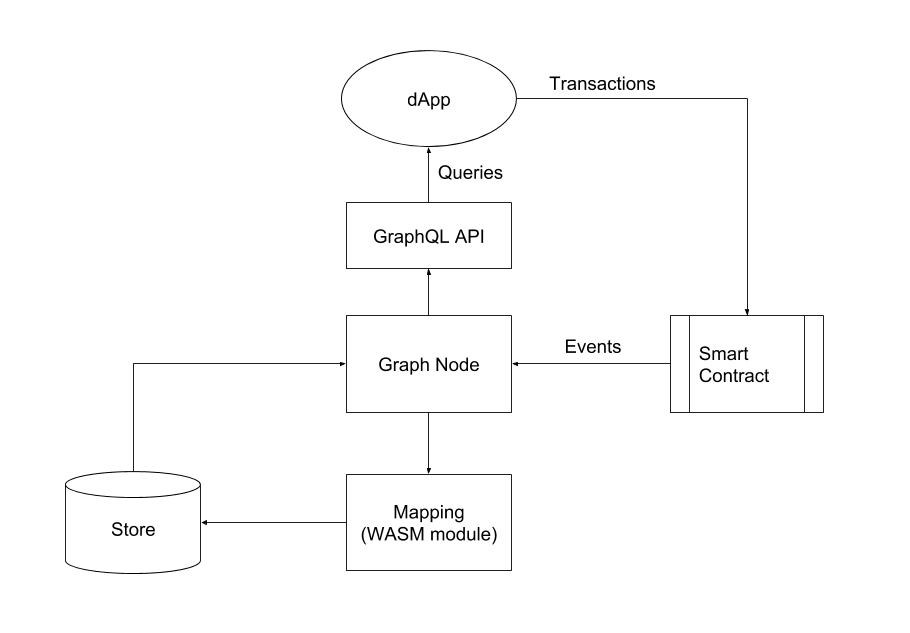

# Getting Started
> **Note**:  this project is heavily WIP and until it reaches v1.0 the API is subject to change in breaking ways without notice.

## 0 Introduction

This page will explain everything you need to know in order to run a local Graph Node, with links to other pages to help. First we will describe what The Graph is, and then we will explain how you can get started!

### 0.1 What is The Graph?

The Graph is a decentralized protocol for indexing and querying data from blockchains, starting with Ethereum. It makes it possible to query for data that is difficult or impossible to query for directly.

For example, with the popular Cryptokitties dApp which implements the [ERC-721 Non-Fungible Token (NFT)](https://github.com/ethereum/eips/issues/721) standard, it is relatively straight forward to ask the following questions:
> *How many cryptokitties does a specific Ethereum account own?*
> *When was a particular cryptokitty born?*

This is because these read patterns are directly supported by the methods exposed by the [contract](https://github.com/dapperlabs/cryptokitties-bounty/blob/master/contracts/KittyCore.sol): the [`balanceOf`](https://github.com/dapperlabs/cryptokitties-bounty/blob/master/contracts/KittyOwnership.sol#L64) and [`getKitty`](https://github.com/dapperlabs/cryptokitties-bounty/blob/master/contracts/KittyCore.sol#L91) methods, respectively.

However, other questions are more difficult to answer:
> *Who are the owners of the cryptokitties born between January and February of 2018?*

For this you would need to process all [`Birth` events](https://github.com/dapperlabs/cryptokitties-bounty/blob/master/contracts/KittyBase.sol#L15) and then call the [`ownerOf` method](https://github.com/dapperlabs/cryptokitties-bounty/blob/master/contracts/KittyOwnership.sol#L144) for each cryptokitty that has been born into existence. (An alternate approach could involve processing all [`Transfer` events] and filtering on the most recent transfer for each cryptokitty in existence).

Even for this relatively simple question, it would take hours to days for a decentralized application (dApp) running in a browser to get an answer. Indexing and caching data off blockchains is hard. There are edge cases around finality, chain reorganizations, uncled blocks, etc.

The Graph solves this today by providing an open source node implementation, [Graph Node](../README.md), which handles indexing and caching of blockchain data, which the entire community can contribute to and leverage. It exposes this functionality through a GraphQL API.

### 0.2 How Does it Work?

The Graph must be run alongside a running IPFS node, Ethereum node and a store (Postgres, in this initial implementation).



The high level data flow is as follows:
1. A decentralized application creates/modifies data on Ethereum through a transaction to a smart contract.
2. The smart contract emits one or more events (logs) while processing the transaction.
3. Graph Node listens for specific events and fires handlers in a user-defined mapping.
4. The mapping is a WASM module which runs in a WASM runtime. It creates one or more store transactions in response to Ethereum events.
5. The store is updated along with indexes.
6. A decentralized application queries the Graph Node for data indexed from the blockchain, using the node's [GraphQL endpoint](https://graphql.org/learn/). The Graph Node in turn translates the GraphQL queries into queries for its underlying data store in order to fetch this data, making use of the store's indexing capabilities.
7. The decentralized application displays this data in a rich UI, which an end-user leverages in making new transactions against the Ethereum blockchain.
8. The cycle repeats.

### 0.3 What's Included?
There are three repos relevant to building on The Graph:
1. [Graph Node](../README.md) (this repo) - A server implementation for indexing, caching and serving queries against data from Ethereum.
2. [Graph CLI](https://github.com/graphprotocol/graph-cli) - A CLI for building and compiling projects which are deployed to Graph Node.
3. [Graph TypeScript Library](https://github.com/graphprotocol/graph-ts) - TypeScript/AssemblyScript library for writing subgraph mappings to be deployed to The Graph.

### 0.4 Getting Started Overview
Below we outline the required steps to build a subgraph from scratch, that will be serving up queries from a GraphQL endpoint. There are three major steps:

1. Define The Subgraph

    1. [Create a subgraph project and manifest](#3-defining-the-subgraph)
    
    2. [Define data sources](#31-define-the-data-sources-and-create-a-manifest)
    
    3. [Define a GraphQL schema](#32-create-the-graphql-schema-for-the-data-source)
    
    4. [Generate types for use in the subgraph mappings](#33-graph-cli)
    5. [Write mappings](#34-writing-mappings)
2. Build and Deploy The Subgraph
    1. [Build and deploy mappings to IPFS](#41-build-and-deploy-the-mappings-to-ipfs)
    
    1. [Deploy the subgraph to the local Graph Node](#42-deploying-the-subgraph)
3. Query The Subgraph
    1. [Query the newly deployed GraphQL API](#5-query-the-local-graph-node)

Now let's dig in!

## 3 Defining The Subgraph 
When we refer to a subgraph we are referring to the whole project. Once deployed to the decentralized network, it will form a part of a global graph of blockchain data.

You can now create an empty repository to start the project. We will add the first file in section 3.1. 

### 3.1 Define The Data Sources and Create a Manifest

When building a subgraph you must decide ahead of time what blockchain data you want to index in a Graph Node. This is the `data source`, and it comprises of data on blockchain (i.e. an Ethereum smart contract).

The subgraph is defined by a YAML file called a **subgraph manifest**. This file should always be named `subgraph.yaml`. The full specification for the subgraph manifest can be viewed [here](subgraph-manifest.md). It comprises of a schema, data sources and mappings which are used to deploy the GraphQL endpoint.

Let's go through an example to show what a subgraph manifest should look like. We will use the common ERC721 contract as it is familiar to many developers. Below we have defined a subgraph manifest with a single `data sources`, which is a smart contract implementing the ERC721 interface:
```yaml
specVersion: 0.0.1
schema:
  file: ./schema.graphql
dataSources:
- kind: ethereum/contract
  name: MyERC721Contract
  source:
    address: "0xf87e31492faf9a91b02ee0deaad50d51d56d5d4d"
    abi: ERC721
  mapping:
    kind: ethereum/events
    apiVersion: 0.0.1
    language: wasm/assemblyscript
    entities:
    - Token
    abis:
    - name: ER721
      file: ./abis/ERC721ABI.json
    eventHandlers:
    - event: Transfer(address,address,uint256)
      handler: handleTransfer
    file: ./mapping.ts
```
We will point out a few important facts from this example that are supplementary to reading the subgraph manifest spec mentioned above:

* The name `ERC721` under `source > abi` must match the name of the displayed underneath `abis >name`.
* The event `Transfer(address,address,uint)` under `eventHandlers` must exactly match what is in the ABI. The name `handleTransfer` under `eventHandlers:handler` must exactly match the name of the mapping function (mappings will be explained in a few sections). 
* Make sure you have the right contract address under `source > address`. Expecially when you are also deploying on testnets. The contract address may start with or without a `0x` prefix.
* You can define multiple data sources under dataSources. Within a datasource you can also have multiple `entities` and `events`. See [this subgraph](https://github.com/graphprotocol/decentraland-subgraph/blob/master/subgraph.yaml) for an example.
* If the Graph CLI outputs 'Failed to copy subgraph files', it probably means you have a typo in the manifest.

#### Getting The ABI 
The ABI JSON file must contain the correct ABI to source all the events you wish to ingest into the Graph Node. There are a few ways to get an ABI for the contract: 
* If you are building your own project, you should likely have access to your most current ABIs. 
* If you are building a subgraph for a public project, you can download that project to your computer and get the ABI by using [`truffle compile`](https://truffleframework.com/docs/truffle/overview) or using `solc` to compile. 
* Sometimes you can also find the ABI on [Etherscan](https://etherscan.io), but this isn't always reliable, as the ABI that is uploaded there may be out of date. Make sure you have the right ABI, otherwise you won't be able to start a Graph Node. 

If you are running into troubles here, double check the ABI and make sure the event signatures exist *exactly* as you expect them to be, by examining the smart contract code you are sourcing. Also note with the ABI you only need the array for the ABI. Compiling the contracts locally results in a `.json` file that contains the full ABI nested within the `.json` file, under the key `"abi"`.

Once the `subgraph.yaml` file is created, you can move onto the next section. 

### 3.2 Create The GraphQL Schema for the Data Source 
GraphQL schemas are defined using the GraphQL interface definition language (IDL). If you've never written a GraphQL schema, we recommend checking out a [quick primer](https://graphql.org/learn/schema/#type-language) on the GraphQL type system.

With The Graph, you don't have to define the top-level `Query` type, you simply define entity types, and Graph Node will generate top level fields for querying single instances and collections of that entity type. Each type that should be an entity is required to be annotated with an `@entity` directive.

As you can see in the example `subgraph.yaml` manifest above, there is one entity named `Token`. Let's define what that would look like for the GraphQL Schema. 

##### Example
Define a Token entity type:
```graphql
type Token @entity {
  id: ID!
  currentOwner: Address!
}
```

This `entity` is tracking a single ER721 token on Ethereum. It tracks the token by it's id and the current owner. The `id` field is required, and it stores values of the ID type, which are strings. The `ID` must be a unique value. For an ERC721 token, the unique ID could be the token ID, as that value is unique to that coin. 


The exclamation mark represents the fact that that field must be set when the entity is stored in the database (i.e. it can't be `null`). See the [Schema API](graphql-api.md#3-schema) for a complete reference on defining the schema for The Graph.

Once you've completed the schema, add the path of the schema to the top level `schema` key in the subgraph manifest. See the code below for an example:

```yaml
specVersion: 0.0.1
schema:
  file: ./schema.graphql
```


### 3.3 Graph CLI
Once you have the `subgraph.yaml` manifest and the `./schema.graphql` file, you are ready to use the Graph CLI to set up the subgraph directory. The Graph CLI is a command line tool that contains helpful commands for deploying the subgraphs. Before continuing with this guide, please go to the [Graph CLI README](https://github.com/graphprotocol/graph-cli/) and follow the instructions up to Step 7 for setting up the subgraph directory.

Once you run `yarn codegen` as outlined in the Graph CLI README, you are ready to create mappings! What this command does is it looks at the contract ABIs defined in the subgraph manifest, and generates TypeScript types for all of the ABIs (actually AssemblyScript types, but more on that later) for the smart contracts the mappings script will interface with, including the types of public methods and events.

This is incredibly useful for writing correct mappings, as well as improving developer productivity using the TypeScript language support in your favorite editor or IDE.

### 3.4 Writing Mappings

The mappings you write will perform transformations on the Ethereum data you are sourcing, and it will dictate how this data is loaded into The Graph Node. Mappings can be very simple, or they can get very complex, it depends how different you want the data to be, compared to how Ethereum delivers it through events and contract state. 

Mappings are written in a subset of TypeScript called AssemblyScript which can be compiled down to WASM. AssemblyScript is stricter than normal TypeScript, yet provides a familiar syntax. A few TypeScript/Javascript features which are not supported in AssemblyScript include plain old Javascript objects (POJOs), untyped arrays, untyped maps, union types, the `any` type and variadic functions. `switch` statements also work differently. See [the AssemblyScript wiki](https://github.com/AssemblyScript/assemblyscript/wiki) for a full reference on AssemblyScript.

In the mapping file, create exported functions named after the event handlers in the subgraph manifest. Each handler should accept a single parameter called `event` with a type corresponding to the name of the event which is being handled (this type was generated for you in the previous step).

```typescript
export function handleTransfer(event: Transfer): void {
  // Event handler logic goes here
}
```

As mentioned, AssemblyScript does not have untyped maps or plain old Javascript objects, so to represent a collection of key value tuples with heterogeneous types, an `Entity` type is included in the mapping types. This `Entity` type can be imported from the [Graph Typescript Library](https://github.com/graphprotocol/graph-ts), which is a typescript/assemblyscript library. The `Entity` type has different setter methods for different types, satisfying AssemblyScript's requirement of strictly typed functions (and no union or `any` types).

Let's look at an example. Staying in line with our previous token example, lets write a mapping that will track the owner of a particular ERC721 token. 

#### Example
```typescript

export function handleTransfer(event: Transfer): void {
    let token = new Entity()
    
    token.setString('id', event.params.tokenId.toHex())
    token.setAddress('currentOwner', event.params.to)
    
    store.set('Token', event.params.tokenId.toHex(), token)
}

```
There are a few things going on here:
* We create a new Entity named `token`. This entity will be stored in the Graph Node database, and must have a unique ID
* This entity is getting updated by the `Transfer` event emitted by the ERC721 contract. 
* We set the ID for the entity. For an ERC721 token it should be the tokenId. We get the token ID from the event emitted by Ethereum, which was turned into an assembly script type by the Graph TypeScript Library, and we can access it at `event.params.tokenId`. Note that you must set `id` as a string, and call `toHex()` on the tokenId to turn it into a hex string.
* The current owner is gathered from the event with `event.params.to`. Since it is an address, we use setAddress().
* `store.set()` is used. `store` is also imported from `graph-ts`, just like `Entity`. It is used for setting the value(s) of a particular entities attribute(s) in the store. There is also a `store.get()` function. These will be explained more below. 


#### Using the `store` API 

The event handlers functions return `void`. The only way that entities may be added to the Graph is by calling `store.set()`. `store.set()` may be called multiple times in an event handler. `store.set()` will only set the entity attributes that have explicitly been set on the `Entity`. Attributes which are not explicitly set, or unset by calling `Entity.unset(<attribute>)`, will not be overwritten. `store.set` expects the name of an entity type, the ID of the entity and the `Entity` itself. See the definition below:

```
store.set(entity: string, id: string, data: Entity)`
```

You can use `store.get` to retrieve information previously added with `store.set`. `store.get` expects the entity type and ID of the entity. Along with `store.get()` you can use `.getString()`, `.getU256()`, etc. for getting attribute values from the entity (once again, all these functions come from the [Graph Typescript Library](https://github.com/graphprotocol/graph-ts)). See the definition below for `store.get()`:

```
store.get(entity: string, id: string)
```

##### Using store.get()
Let's look at the token example to see how you can use `store.get()`. We showed in the previous example how to use `store.set()`. Now, let's consider that you have another mapping that needs to retrieve the currentOwner of an ERC721 token. In order to do this within a mapping, you would write the following:

```typescript
  let token = store.get('Token', tokenID.toHex())
  if (token !== null) {
    let owner = token.getString("currentOwner")
  }
```

You now have the `owner` data, and you can use that in the mapping to set the owner value to a new entity. 

#### Calling into the Contract Storage to Get Data

You can also grab data that is stored in one of contracts you have included ABIs for. Any state variable that is marked `public`, or any `view` function can be accessed. Below shows how you grab the token symbol of an ERC721 token, which is a state variable of the smart contract. You would add this inside of the event handler function.  

```typescript
  let tokenContract = ERC721.bind(event.address);
  let artPieceTokenAddress = tokenContract.symbol();
```

Note that we are using an ERC721 class generated from the ABI, that we are calling bind on. This is gathered from the subgraph manifest here:
```
  source:
    address: "f87e31492faf9a91b02ee0deaad50d51d56d5d4d"
    abi: ERC721
```

The class is imported from the ABI's TypeScript file generated via yarn codegen.

## 4 Build and Deploy The Subgraph 

### 4.1 Build and deploy the mappings to IPFS
In order to deploy the subgraph to the Graph Node, the subgraph will first need to be built and stored on IPFS (along with all linked files).

To get an IPFS daemon working locally, do the following:
* Download and install IPFS 
* run `ipfs init`
* run `ipfs daemon`

If you get stuck, you can follow the instructions from the IPFS website [here](https://ipfs.io/docs/getting-started/).

Once you've started the IPFS daemon you can run `yarn deploy` in the subgraph directory (make sure to pass the right host and port to 'graph deploy' via the '--ipfs' argument). `yarn deploy` should have been set up in section 3.3 when you went through the [Graph CLI documentation](https://github.com/graphprotocol/graph-cli). This will compile the mappings, and deploy the mappings, schema and the subgraph manifest itself to IPFS.

To confirm the subgraph is stored on IPFS, you can pass that subgraph ID into `ipfs cat` to view the subgraph manifest with file paths replaced by IPLD links.

### 4.2 Deploying The Subgraph

Deploying the subgraph means the subgraph is running, and sourcing data from Ethereum, transforming that data with the mappings, and storing it in the Graph Node. Note that a running subgraph can safely be stopped and started, and it will pick up where it has left off. 

#### 4.2.1 Create the Postgres db 

Make sure you have Postgres installed. Then run the following commands:

`initdb -D .postgres`
`createdb <POSTGRES_DB_NAME>`

Name the database something relevant to the project, so you always know how to access it. 

#### 4.2.3 Connecting to an Etheruem Node

When you deploy the subgraph, you need to tell the subgraph which Ethereum network to connect to. There are three common ways you can grab data which are:
 * Infura
 * A local Ethereum Node 
 * Ganache 

##### 4.2.3.1 Infura

[Infura](https://infura.io/) is supported, and is the simplest way to source mainnet or testnet data, as you don't have to set up your own geth or parity node. However, it does sync slower than being connected to your own node. The following flags are passed to the Graph Node to indicate you want to use Infura:

```
cargo run -p graph-node --release -- \
  --postgres-url postgresql://<USERNAME><:PASSWORD>@localhost:5432/<POSTGRES_DB_NAME> \
  --ethereum-rpc <ETHEREUM_NETWORK_NAME>:https://mainnet.infura.io`
  --ipfs 127.0.0.1:5001 \
```

Also Note that the Postgres database may not have a password at all. If that is the case, the Postgres connection URL can be passed as follows:

`  --postgres-url postgresql://<USERNAME>@localhost:5432/adchain-subgraph \ `

##### 4.2.3.2 Local Geth or Parity Node

This is the fastest way to get mainchain or testnet data. The problem is, if you don't already have a synced [geth](https://github.com/ethereum/go-ethereum/wiki/geth) or [parity](https://github.com/paritytech/parity-ethereum) node, you will have to sync one, which will take a very long time. Also, note that geth `fast sync` works, so if you are starting from scratch this is fastest. But expect at least  12 hours of syncing on a modern laptop to sync geth. Normal mode geth or parity will take much longer. The following geth command can be used to get you started syncing:

`geth --syncmode "fast" --rpc --ws --wsorigins="*" --rpcvhosts="*" --cache 1024`

Once you have the local node fully synced, you can run the following command:

```
cargo run -p graph-node --release -- \
  --postgres-url postgresql://<USERNAME><:PASSWORD>@localhost:5432/<POSTGRES_DB_NAME> \
  --ethereum-rpc <ETHEREUM_NETWORK_NAME>:127.0.0.1:8545`
  --ipfs 127.0.0.1:5001 \
```

Note that this assumes the local node is on the default `8545` port. If you are on a different port, change it. 

Note that if you switch back and forth between sourcing data from Infura, and your own local nodes, this is completely fine. 

##### 4.2.3.3 Ganache 

**NOTE: Ganache is not working right now, as we are unable to connect to it properly. Please follow [this upstream issue](https://github.com/trufflesuite/ganache/issues/907) to see if Ganache has been updated, and that we can connect.**

[Ganache](https://github.com/trufflesuite/ganache-cli) can be used as well, and is best used for quick testing. This might be an option if you are just testing out the contracts for quick iterations. Of course, if you close Ganache, the Graph Node will not have any data to source anymore. It is likely that Ganache would be viable in short term projects (i.e. hackathons). Also, it can be useful for testing out that the schema and mappings are working properly, before working on the mainnet. 

 You can connect the subgraph to Ganache the same way you connected to a local geth or parity node in the previous section. Just note that Ganache normally runs on port `9545` instead of `8545`.

##### 4.2.3.3 Local Parity Testnet (Works Similar to Ganache) 

To setup a local testnet that will allow you to rapidly test the project, download the parity software if you don’t already have it. This command will work for a one line install:

`bash <(curl https://get.parity.io -L)`

Next you want to make an account that you can unlock, and make transactions on for the parity dev chain. run the following command:

`parity account new --chain dev`

Make a password you will remember. Take note of the account that gets output. Now you also have to make that password a text file, and pass it into the next command. The desktop is a good location for it. If the password is `123`, only put the numbers in the text file. Do not include any quotes. Then you can run this command:

`parity --config dev --unsafe-expose --jsonrpc-cors="all" --unlock <ACCOUNT_ADDRESS> --password ~/Desktop/password.txt`

The chain should start! This chain will be accessible by default  on `localhost:8545`. It is a chain with 0 block time and instant transactions, making testing very fast. Passing `unsafe-expose` and ` --jsonrpc-cors="all"` as flags allow MetaMask to connect. The `unlock` flag gives parity the ability to send transactions with that account. You can also import the account to MetaMask, and that will let you interact with the test chain directly in your browser. With MetaMask, you need to import the account with the private testnet Ether. The base account that the normal configuration of parity gives you is `0x00a329c0648769A73afAc7F9381E08FB43dBEA72`. The private key is:
```
4d5db4107d237df6a3d58ee5f70ae63d73d7658d4026f2eefd2f204c81682cb7 (note this is the private key given along with the parity dev chain, so it is okay to share)
```
Use MetaMask --> import account ---> private key.

All extra information for customization of a parity dev chain is located [here](https://wiki.parity.io/Private-development-chain#customizing-the-development-chain).

You now have an Ethereum account with a ton of Ether, and you should be able to set up the migrations on this network and use Truffle. Now, send some Ether to the previous account that got created and unlocked, this way you can run `truffle migrate` with this account.

#### 4.2.4 Syncing with a Public Testnet

If you want to sync using a public testnet such as Kovan, Rinkeby, or Ropsten, just make sure the local node is a testnet node, or that you are hitting the correct Infura testnet endpoint. 

## 5 Query the local Graph Node
With the subgraph deployed to the locally running Graph Node, visit http://127.0.0.1:8000/ to open up a [GraphiQL](https://github.com/graphql/graphiql) interface where you can explore the deployed GraphQL API for the subgraph by issuing queries and viewing the schema. 

We have provided a few simple examples below, but please see the [Query API](graphql-api.md#1-queries) for a complete reference on how to query the subgraph's entities.

#### Example
Query all `Token` entities:
```graphql
{
  tokens {
    id
    currentOwner
  }
}
```
Notice that it is just simply `tokens` pluralized, and it will return all of the entites in The Graph. 

Later, when you've deployed the subgraph with this entity, you'll be able to query for a specific value, such as the token ID

```graphql
{
  token(id: "c2dac230ed4ced84ad0ca5dfb3ff8592d59cef7ff2983450113d74a47a12") {
    currentOwner
  }
}
```

You can also sort, filter or paginate query results. This query below would organize all tokens by their ID, and return the current owner of each token. 

```graphql
{
  tokens(orderBy: id) {
    currentOwner
  }
}
```

GraphQL provides a ton of functionality! Once again, check out the [Query API](graphql-api.md#1-queries) to figure out how to use all query features supported. 

## 6 Changing the schema, mappings, and manifest, and launching a new Subgraph

When you first start building the subgraph, it is likely you will make a few iterations to the manifest, mappings, or schema. If you update any of them, you should rerun `yarn codegen` and `yarn deploy`. This will post the new files on IPFS and deploy the new subgraph. Note that the Graph Node can track multiple subgraphs, so you can do this as many times as you like.

## 7 Example Subgraphs

Here is a list of current subgraphs that we have open sourced:
* https://github.com/graphprotocol/ens-subgraph
* https://github.com/graphprotocol/decentraland-subgraph (most complex)
* https://github.com/graphprotocol/adchain-subgraph
* https://github.com/graphprotocol/memefactory-subgraph (only for testing, not live on Ethereum mainnet)

## Contributions

All feedback and contributions in the form of issues and pull requests are welcome!
